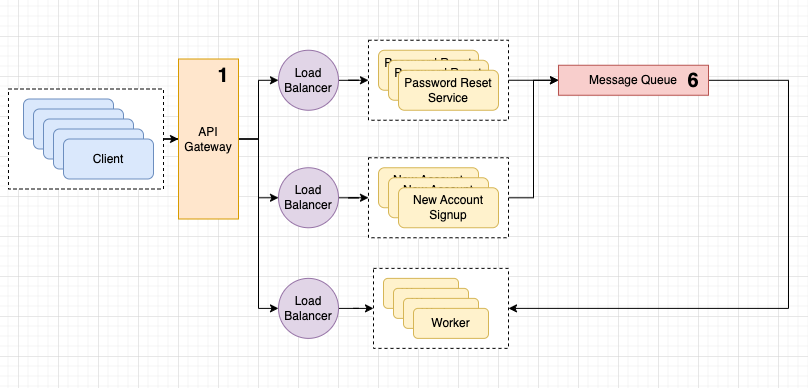

# Kubernetes Cluster Example

## Architecture Plan


## How to configure K8S cluster?
1. Start minikube cluster with `ingress` addon
```bash
minikube start --addons ingress
```

2. Go to `terraform` folder
```bash
cd terraform
```

3. Deploy `zookeeper`, `kafka` and our services to our `minikube` cluster.
```bash
terraform apply --auto-approve
```

4. Go to `k8s` folder to apply missing manifests
```bash
cd ../k8s
```

5. Apply load balancers manifests
```bash
kubectl apply -f service.yaml
```

6. Apply ingress manifest
```bash
kubectl apply -f ingress.yaml
```

7. Start `minikube` tunnel to use ingress locally
```bash
minikube tunnel
```
